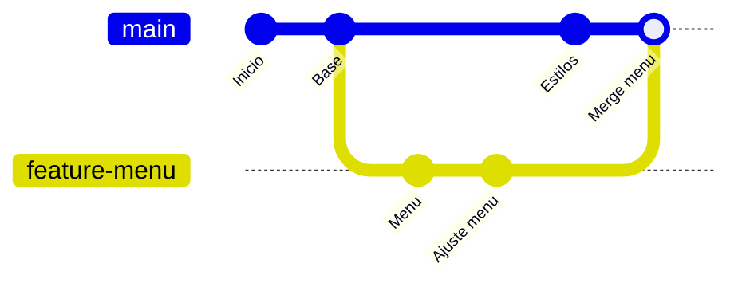
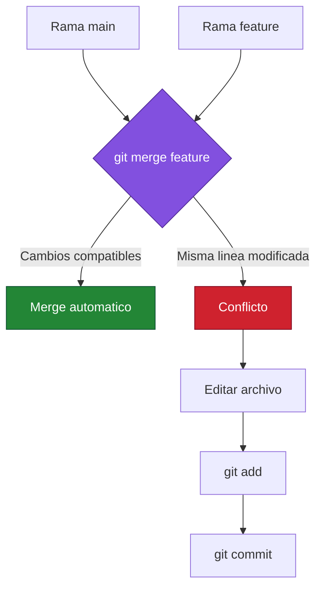
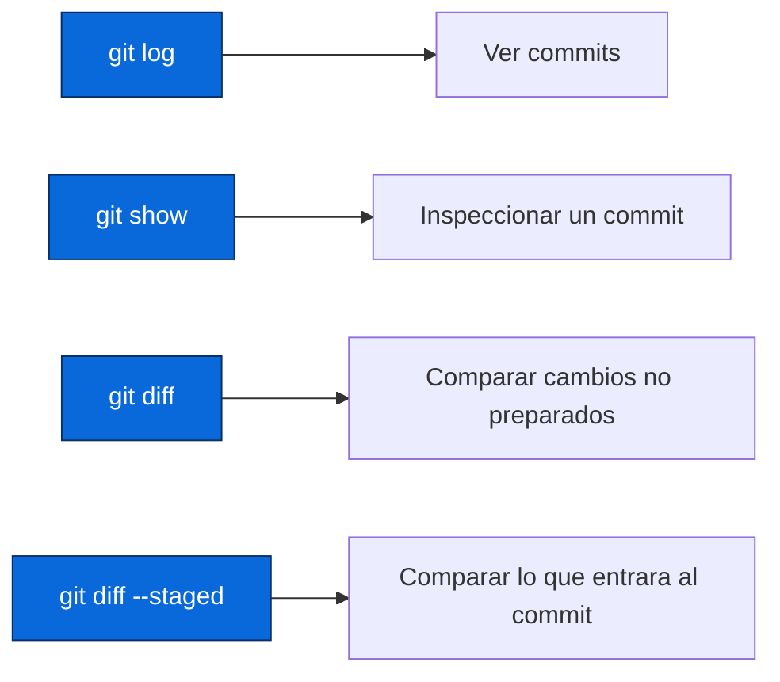
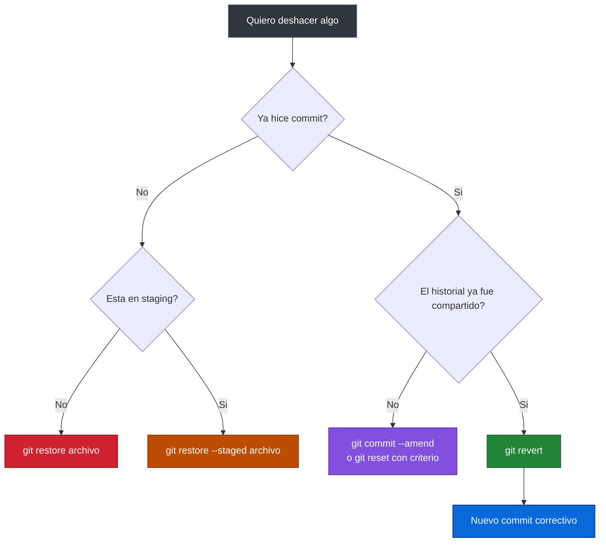

# Git y GitHub Desde Cero


Material del curso **Git y GitHub desde cero - 9na Edicion**. El objetivo es construir una base solida de Git antes de pasar a colaboracion remota con GitHub.

Este repositorio contiene el material actualizado hasta el PPT fusionado de hoy: fundamentos, configuracion, flujo local, ramas, merge, conflictos, lectura de historial y formas seguras de deshacer cambios hasta `git revert`.

## Material Actualizado

| Material | Descripcion |
|---|---|
| [Programa completo fusionado](./material/programa-completo-git-y-github-9na-edicion.pdf) | PPT actualizado con las sesiones 1, 2 y 3 unificadas. |
| [Material base anterior](./material/fundamentos-instalacion-trabajo-local.pdf) | PDF inicial de fundamentos, instalacion y trabajo local. |

> Nota: los temas de `rebase`, `stash`, `cherry-pick`, `reflog`, hooks y laboratorio avanzado pasan a la sesion 4.

## Ruta Del Curso Hasta Hoy


## Temas Que Ya Veremos En El PPT Actual

### 1. Fundamentos De Git Y Control De Versiones

Aprendemos que Git existe para evitar el caos de archivos como `proyecto_final_final.zip`. Git registra la historia del proyecto y permite saber:

- que cambio,
- cuando cambio,
- quien lo cambio,
- y por que se hizo ese cambio.


### 2. Entorno De Trabajo: Instalacion Y Configuracion

Preparamos Git en la maquina local y configuramos la identidad del autor. Esta parte es importante porque cada commit debe quedar asociado a una persona.

Comandos principales:

```bash
git --version
git config --global user.name "Tu Nombre"
git config --global user.email "tu@email.com"
git config --list
```

Tambien revisamos el editor por defecto y la diferencia entre trabajar en Windows, Linux, macOS, PowerShell, Git Bash o terminal integrada de VS Code.

### 3. Flujo Local Con Git

El flujo base de Git local es:

```text
modificar -> preparar -> confirmar -> revisar
```


Comandos principales:

```bash
git init
git status
git add archivo.txt
git add .
git commit -m "Agrega README inicial"
git log --oneline
```

### 4. Ramas En Git

Las ramas permiten trabajar en paralelo sin romper la rama principal. Una rama puede representar una funcionalidad, una correccion o un experimento.



Comandos principales:

```bash
git branch
git switch -c feature/menu
git switch main
git branch -d feature/menu
```

### 5. Merge Y Resolucion De Conflictos

`merge` integra los cambios de una rama dentro de otra. Si las ramas modifican zonas diferentes, Git puede combinar automaticamente. Si modifican la misma zona, aparece un conflicto.



Comandos principales:

```bash
git merge feature/menu
git status
git add archivo-en-conflicto.txt
git commit
```

### 6. Historial E Inspeccion Del Repositorio

Aprendemos a leer el historial como un mapa del proyecto. Esto permite ubicar cambios, revisar commits y comparar diferencias antes de confirmar.



Comandos principales:

```bash
git log --oneline
git log --graph --oneline --all
git show <hash>
git diff
git diff --staged
```

### 7. Deshacer Cambios Hasta `git revert`

La parte final del PPT actual se queda en estrategias seguras para corregir errores. La idea principal es elegir el comando segun el lugar donde esta el cambio.



Comandos principales:

```bash
git restore archivo.txt
git restore --staged archivo.txt
git commit --amend
git reset --mixed HEAD~1
git reset --hard HEAD~1
git revert <hash>
```

Advertencia importante:

- `git reset --hard` puede borrar cambios locales.
- `git revert` es mas seguro cuando el historial ya fue compartido porque no borra commits: crea un commit correctivo.

## Que Pasa A La Sesion 4

Los siguientes temas quedan separados para una sesion posterior:


## Laboratorios Incluidos Hasta Hoy

| Laboratorio | Objetivo |
|---|---|
| Primer repositorio local | Crear un repo desde cero, agregar archivos y hacer commits. |
| Flujo local | Practicar `status`, `add`, `commit`, `restore` y `.gitignore`. |
| Ramas | Crear ramas, moverse entre ellas y mantener trabajo aislado. |
| Merge sin conflicto | Integrar cambios compatibles. |
| Conflictos | Provocar, leer y resolver conflictos manualmente. |
| Historial y correccion | Usar `log`, `diff`, `show`, `amend`, `reset` y `revert`. |

## Comandos Resumen

```bash
# Configuracion
git config --global user.name "Tu Nombre"
git config --global user.email "tu@email.com"

# Flujo local
git init
git status
git add .
git commit -m "Mensaje claro"
git log --oneline

# Ramas y merge
git branch
git switch -c feature/nombre
git switch main
git merge feature/nombre

# Inspeccion y correccion
git diff
git diff --staged
git show <hash>
git restore archivo.txt
git restore --staged archivo.txt
git commit --amend
git reset --mixed HEAD~1
git revert <hash>
```

## Recursos

| Recurso | Enlace |
|---|---|
| Git oficial | [git-scm.com](https://git-scm.com/) |
| Libro Pro Git | [git-scm.com/book](https://git-scm.com/book/en/v2) |
| Documentacion de GitHub | [docs.github.com](https://docs.github.com/) |
| Ubuntu CLI Cheat Sheet | [recursos/ubuntu-cli-cheat-sheet.pdf](./recursos/ubuntu-cli-cheat-sheet.pdf) |

