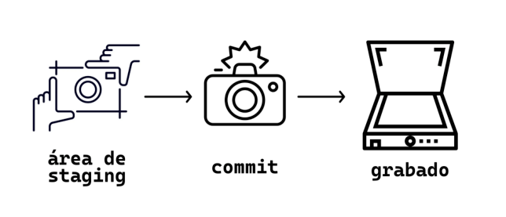
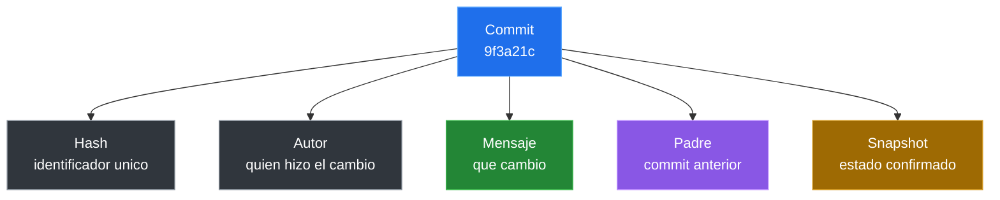
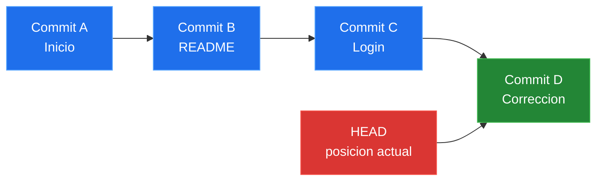

# Estados, Staging Y Commits

## Los Tres Estados De Git

Git trabaja con tres estados principales:

| Estado | Significado |
|---|---|
| Modificado (Working Directory) | El archivo cambio en tu carpeta de trabajo |
| Preparado (Staging Area) | El archivo esta listo para entrar al proximo commit |
| Confirmado (Repository) | El cambio ya fue guardado en el historial |


**Como funciona el flujo**:

1. **Working Directory** (rojo): Creas o modificas archivos aqui. Git detecta los cambios pero no los guarda aun.
2. **Staging Area** (verde): Usas `git add` para preparar los cambios que quieres incluir en el proximo commit.
3. **Local Repository** (azul): Usas `git commit` para guardar permanentemente los cambios preparados en el historial.

**Analogia**:

- **Working Directory**: tu taller donde trabajas en los archivos.
- **Staging Area**: la bandeja donde pones lo que quieres enviar.
- **Repository**: la caja fuerte donde se guarda todo de forma permanente.

## Revisar El Estado Del Proyecto

```bash
git status
```

Este comando muestra:

- Archivos modificados (en rojo).
- Archivos preparados (en verde).
- Rama actual.
- Si hay cambios sin preparar.

**Usalo constantemente** antes y despues de cada accion.

## Preparar Cambios

Para mover archivos del directorio de trabajo al area de staging:

```bash
git add archivo.txt
```

Para preparar todos los cambios a la vez:

```bash
git add .
```

Para preparar archivos de un tipo especifico:

```bash
git add *.md
```

## Verificar Antes De Confirmar

```bash
git status
```

Los archivos en verde estan listos para el commit.

## Crear Un Commit

```bash
git commit -m "Agrega README inicial"
```

## Que Es Un Commit

Un **commit** es una instantanea confirmada del estado del proyecto. Es un punto del historial al que puedes volver, comparar o usar como referencia.


No es simplemente "guardar un archivo". Guardar ocurre en tu editor. El commit ocurre en Git y deja una marca dentro del historial del repositorio.



Un commit registra:

- El estado preparado de los archivos.
- Un identificador unico llamado hash.
- El autor.
- La fecha.
- Un mensaje.
- El commit anterior, tambien llamado padre.



Regla practica del PPT: si no puedes resumir el cambio en una frase clara, probablemente el commit es demasiado grande.

## Que Guarda Realmente Un Commit

Un commit guarda una fotografia del proyecto en ese momento.

- Guarda el estado de todos los archivos preparados.
- Incluye autor, fecha y mensaje.
- Genera un identificador unico (hash SHA-1).

Ejemplo de historial:

```text
a1b2c3d Agrega README inicial
b4c5d6e Agrega validacion de email
c7d8e9f Corrige estilos del formulario
```

Cada linea representa una decision guardada en el tiempo.

## Guardar Archivo Vs `git add` Vs `git commit`

| Accion | Que significa |
|---|---|
| Guardar archivo | El cambio queda en tu carpeta local |
| `git add` | Preparas el cambio para el proximo commit |
| `git commit` | Guardas una version oficial en el historial |

Puedes guardar muchas veces un archivo, pero hacer commit solo cuando el cambio ya tiene sentido.

### Commits Y HEAD



`HEAD` es un puntero que indica en que commit estas parado. Siempre apunta al ultimo commit de la rama actual.

## Ver El Historial

```bash
git log
```

Para ver una version compacta:

```bash
git log --oneline
```

## Commits Atomicos

Cada commit debe representar un solo cambio logico:

- **Bien**: `Agrega validacion de email`
- **Mal**: `cambios varios`

Un commit atomico facilita:

- Revertir cambios especificos.
- Entender el historial.
- Trabajar en equipo.

## Buenos Mensajes De Commit

- Usa imperativo: `Agrega`, `Corrige`, `Elimina`.
- Se conciso pero claro.
- Explica el que y el por que si es necesario.

Ejemplos:

```text
Agrega pagina de login
Corrige error de validacion en formulario
Elimina archivos temporales del repositorio
```

## Laboratorio Relacionado

- [Staging y commits atomicos](../laboratorios/staging-y-commits-atomicos.md): practica el paso de working directory a staging y la creacion de commits pequenos.

---

[&larr; Anterior: Primer repositorio local](./05-repositorio-local.md) | [Siguiente: Deshacer cambios &rarr;](./07-deshacer-cambios.md)


[def]: image.png
