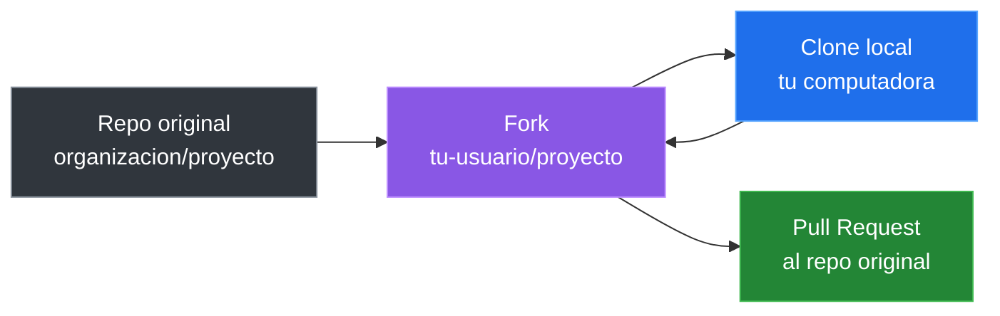

# Forks Y Flujo Open Source

Un **fork** es una copia de un repositorio que vive en tu cuenta de GitHub. Se usa mucho cuando no tienes permisos directos para escribir en el repositorio original.

## Fork Vs Clone

| Concepto | Donde ocurre | Para que sirve |
|---|---|---|
| Fork | GitHub | Crear una copia en tu cuenta |
| Clone | Tu computadora | Descargar un repo para trabajar localmente |

## Flujo Con Fork



## Configurar `upstream`

Cuando clonas tu fork, `origin` apunta a tu copia. El repo original se suele configurar como `upstream`.

```bash
git remote add upstream https://github.com/organizacion/proyecto.git
git remote -v
```

Ejemplo:

```text
origin    https://github.com/tu-usuario/proyecto.git
upstream  https://github.com/organizacion/proyecto.git
```

## Mantener Tu Fork Actualizado

```bash
git fetch upstream
git switch main
git merge upstream/main
git push origin main
```

## Hacer Una Contribucion

```bash
git switch -c fix/typo-readme
# editar archivos
git add .
git commit -m "corrijo typo en readme"
git push -u origin fix/typo-readme
```

Luego abres un Pull Request desde tu fork hacia el repositorio original.

## Buenas Practicas Al Contribuir

- Lee el README y las guias de contribucion.
- Crea ramas pequenas y claras.
- No mezcles varios cambios no relacionados.
- Explica que problema resuelve tu PR.
- Acepta feedback sin tomarlo personal.

---

[&larr; Anterior: Pull Requests](./13-pull-requests.md) | [Siguiente: Flujo profesional &rarr;](./15-flujo-profesional.md)
